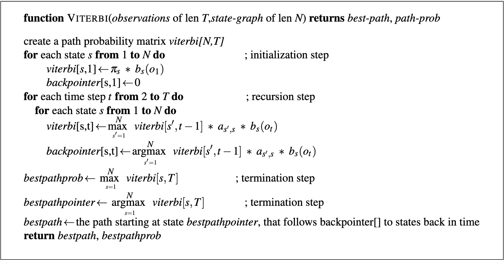

# Hidden Markov Models (HMM)

### Preprocessing workflow:
  * Transform the raw data to a series of lists (or generators) of observations, states, and (observation, state) pairs
  * Split the (observation, state) tuples or pairs into train/test sets
  * Create the observation_map and state_map using the integer_map() function
  * Create the transition, emission, and Pi matrices.
  * Transform the above matrices into log10 probabilities, then save as compressed numpy binary dumps

### Model training and inference:
  * Use the Viterbi.py script along with the transition, emission, and Pi matrices to generate the most likely sequence of hidden states. Print out the kappa score or accuracy for the test sequences.

#### According to Dan Jurafsky and James Martin's book [Speech and Language Processing](https://web.stanford.edu/~jurafsky/slp3/8.pdf), a hidden markov model (HMM) is comprised of the following 5 components:
  * Q: a set of N **states**.
  * A: a **transition probability matrix**, with each element aij representing the probability of transitioning from state i to state j, subject to the constraint that the sum of these elements is 1 (forming a proper probability distribution)
  * O: a set of T **observations**, each one drawn from a vocabulary V.
  * B: a set of observation likelihoods, also called **emission probabilities**, each expressing the probability of an observation ot being generated from a state i.
  * pi: an **initial probability distribution** over states. pi i is the probability that the markov chain will start in state i. Some states j may have pi j = 0, meaning they cannot be initial states. As with the transition probabilities, all must sum to one to form a valid probability distribution.

#### A  first-order  hidden  Markov  model  instantiates  two  simplifying  assumptions:
   * First, as with a first-order Markov chain, the probability of a particular state depends only on the previous state: **Markov Assumption**:
     * 
   * Second, the probability of an output observation oi depends only on the state that produced the observation qi and not on any other states or any other observations: **Output Independence**:
     * 

#### An HMM has two probability matrices, A and B:
   * **Matrix A** contains the tag transition probabilities P(ti|ti−1) which represent the probability of a tag occurring given the previous tag. We compute the maximum likelihood estimate of this transition probability by counting, out of the times we see the first tag in a labeled corpus, how often the first tag is followed by the second: 
     *  
     * This matrix will have dimensions (N * N), where N is the number of tags.
   * **Matrix B** (emission probabilities, P(wi|ti)), represents the probability, given a tag, that it will be associated with a given word. The MLE of the emission probability is:
     * 

#### The  goal  of  HMM  decoding:
   * Given an HMM λ = (A,B), and a sequence of observations O, find the most probable sequence of states Q:
     * 
   * The way we would do this in the context of an HMM is to use Bayes' rule:
     *      
   * We can simplify a bit by dropping the denominator:
     * 

#### HMM taggers make two further simplifying assumptions:
   * The first is that the probability of a word appearing depends only on its own tag and is independent of neighboring words and tags:
     * 
   * The second assumption, the **bigram assumption**, is that the probability of a tag is dependent only on the previous tag, rather than the entire tag sequence:
     * 

#### With our two simplifying assumptions, the equation for the most probable tag sequence simplifies to:
   * 
   *  
     Corresponds to our emission probability matrix.
   *  
     Corresponds to our transmission probability matrix.

#### The Viterbi decoding algorithm:
   * First, set up a probability matrix (or lattice), with one column for each observation ot and one row for each state in the state graph.
   * Each cell of the trellis, vt(j), represents the probability that the HMM is in state j after seeing the first t observations and passing through the most probable state sequence q1,...,qt−1, given the HMM λ. 
   * The value of each cell vt(j) is computed by recursively taking the most probable path that could lead us to this cell. 
   * Formally, each cell expresses the probability vt(j):
     * 
   * We represent the most probable path by taking the maximum over all possible previous state sequences max q1,...,qt−1

